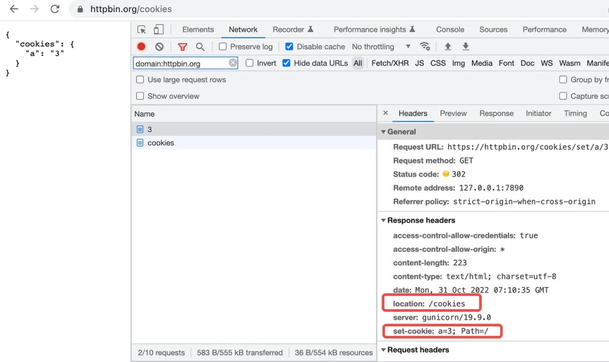
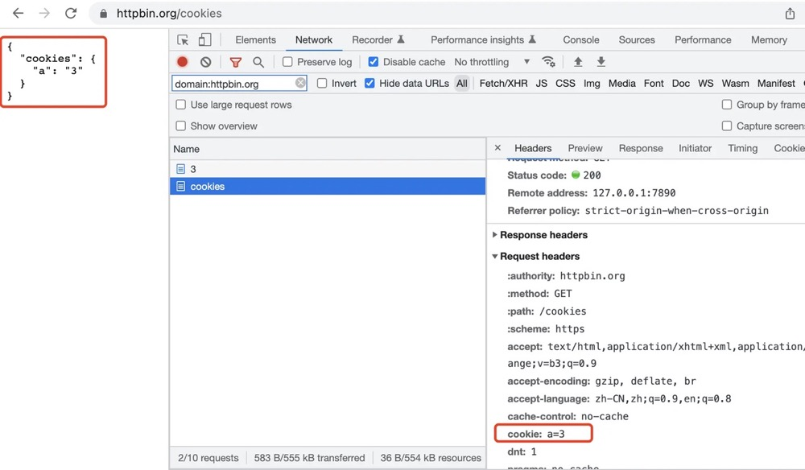
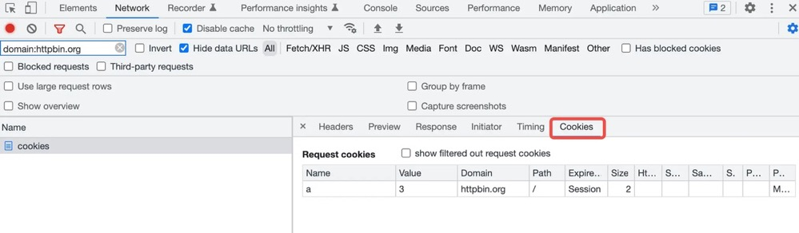
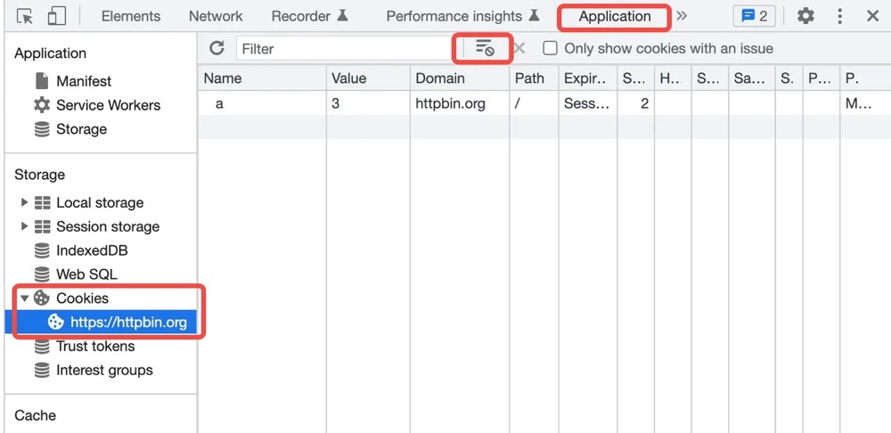

# Cookie 初识

HTTP 是一种无状态协议。如以下场景，在爬虫时非常常见。

1. 访问权限页面，无法访问，请先登录。
2. 登录。
3. 访问权限页面，无法访问，请先登录。

而在 HTTP 中，Cookie 使保持状态成为可能。

1. 访问权限页面，无法访问，请先登录。
2. 登录
3. 访问权限页面，携带 Cookie 可访问。
   Cookie，为曲奇饼干的意思，因此 Cookie 的标识，常为一个曲奇饼干 🍪。

## Set-Cookie/Cookie 头部

Cookie 既可以在浏览器进行创建，也可以在服务器进行配置。在服务器中，通过
Set-Cookie 响应头进行配置。

```bash
Set-Cookie: a=3
Set-Cookie: b=4
```

而在浏览器中的后续访问中，如果该请求是同域名的，将会自动携带 Cookie。

```bash
Cookie: a=3; b=4
```

通过 curl 以及 httpbin 示例如下：

```js
// 请求该地址，将自动配置 a=3 的 cookie，并 302 重定向到 /cookies 页面
// 可从第二个请求看到，并没有自动携带 Cookie，因为 Cookie 需要浏览器进行管理
$ curl --head -L https://httpbin.org/cookies/set/a/3
HTTP/2 302
date: Mon, 31 Oct 2022 06:54:57 GMT
content-type: text/html; charset=utf-8
content-length: 223
server: gunicorn/19.9.0
location: /cookies
set-cookie: a=3; Path=/
access-control-allow-origin: *
access-control-allow-credentials: true

HTTP/2 200
date: Mon, 31 Oct 2022 06:54:58 GMT
content-type: application/json
content-length: 20
server: gunicorn/19.9.0
access-control-allow-origin: *
access-control-allow-credentials: true
```

因为 HTTP 无状态的协议，在 curl 中，同样无法复用 Cookie，而在浏览器中方能自动携带 Cookie。
在浏览器中打开地址 <https://httpbin.org/cookies/set/a/3> 进行测试。





但是，在 curl 中，可手动指定 Cookie 字段进行发送：

```bash
$ curl 'https://httpbin.org/cookies' -H 'cookie: a=3; b=4'
{
  "cookies": {
    "a": "3",
    "b": "4"
  }
}
```

## 浏览器控制台

在浏览器控制台，网络面板，每一条请求的详细信息中，可查看其发送和接收的 Cookie。



在浏览器控制台，Application 面板，Storage/Cookies 选项卡中，可对 Cookie 进行增加删除以及编辑。



## 作业

1. 服务器端如何配置携带浏览器的 Cookie

   通过 Set-Cookie 响应头进行配置

2. 浏览器发送 Cookie 时，应如何发送

   - 非跨域时，若服务器配置了 cookie，浏览器自动在 header 中携带
   - 跨域时，即使服务器配置了 cookie，浏览器也不会自动添加 cookie，需要在浏览器请求 api 配置 withCredentials，需要在服务端配置 cookie 的属性 sameSite 为 none 与 Secure 为 true，所以跨域 cookie 只支持 https

3. 通过 curl/httpbin 模拟发送 Cookie

```bash
  # 通过curl
  $ curl 'https://httpbin.org/cookies' -H 'cookie: a=3; b=4'
```
