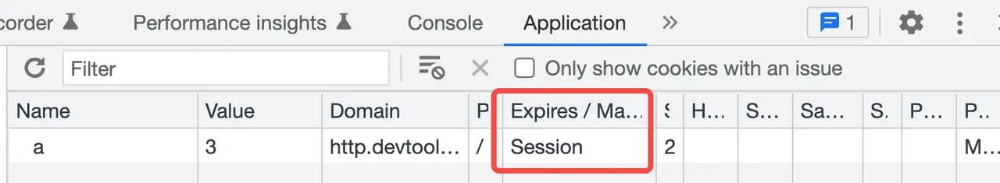

# Cookie 的属性

Cookie 除了简单的 key/value 属性，还有诸多至关重要的属性，比如：

- Domain：为 Cookie 指定的域名
- Path：为 Cookie 指定的路径
- Expire/MaxAge：Cookie 在浏览器上的缓存时间
- HttpOnly：无法通过 Javascript 操作 Cookie，但在浏览器控制台中可以看到该值
- Secure：仅能通过 HTTPS 协议传递
- SameSite：跨站点 Cookie 发送策略 (跨站点与跨域略有不同)

## 测试

> 注：在 httpbin 下无法配置 Cookie 诸多属性，不是很方便，我写了一个 API 完成这些事情，为：<https://http.devtool.tech/api/cookies>，源码见 <https://github.com/shfshanyue/httpstatus>

- <https://http.devtool.tech/api/cookies/set/a/3>
- <https://http.devtool.tech/api/cookies/set/b/4?maxAge=10000>：Cookie 将在 10000 秒后过期
- <https://http.devtool.tech/api/cookies/set/c/5?domain=.devtool.tech>：可配置公共域名
- <https://http.devtool.tech/api/cookies/set/c/5?domain=.baidu.com>：配置其它域名无法生效
- <https://http.devtool.tech/api/cookies/set/d/6?httpOnly=false>
- <https://http.devtool.tech/api/cookies/set/d/6?secure=true>

## Domain

Cookie 是可以跨域的，但是无法跨站点。
在 hello.devtool.tech 上，可以获取到 .devtool.tech 的 Cookie，利用该特性，可配置权限信息至根域名的 Cookie 上，即可以完成全站子域名共同登录。

1. 在 hello.devtool.tech 访问权限页面，无法访问，请先登录。
2. 在 hello.devtool.tech 登录，服务器端 Set-Cookie: token=hello; domain=.devtool.tech 将权限信息配置到根域名
3. 在 world.devtool.tech 访问权限页面，因 Cookie 在根域名 .devtool.tech，可以直接访问

## Expire/MaxAge

Cookie 的过期时间通过 Expire/MaxAge 属性进行配置，如权限信息，一般保存为七天，就可以通过配置过期时间进行实现。
如不配置过期时间，则 Cookie 会被标记为 Session Cookie，在本次会话结束后 Cookie 过期。

## HttpOnly

在浏览器中，可通过 document.cookie 获取 Cookie 属性，并操作进行增删改查。但是无法获取到配置了 HttpOnly 属性的 Cookie。
通过 HttpOnly 属性，Cookie 无法被 Javascript 获取到，则可以避免 XSS（跨站脚本攻击） 对 Cookie 的攻击，无法通过注入脚本的方式获取到 Cookie。

> 注：HttpOnly 仅仅能避免 XSS 对 Cookie 窃取的攻击，但 XSS 仍然可以执行脚本进行其它方面的攻击。避免 XSS 攻击的最有效办法是 CSP（内容安全策略），也是通过 HTTP 配置，将在以后篇章涉及。

## Secure

标记为 Secure 的 Cookie 无法在 HTTP 协议下传递，只能在更加安全的通过加密的 HTTPS 协议下传递，避免了中间人攻击，获取敏感数据。

## 作业

1. Cookie 有哪些属性
2. Cookie HttpOnly 是什么意思
