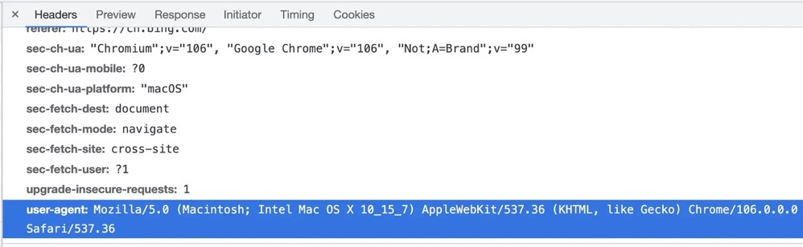
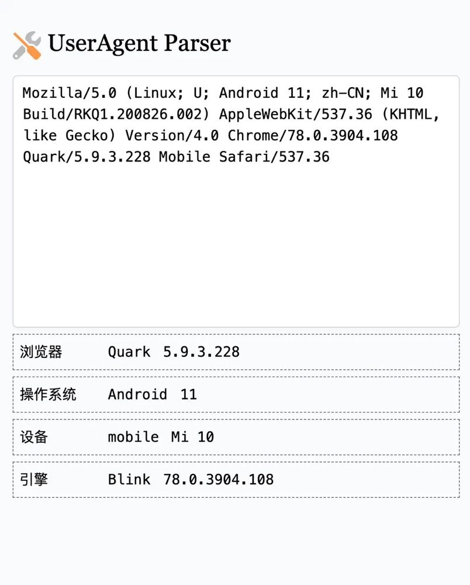

# User-Agent

User-Agent 请求头是用以表明客户端的特征字符串，一般也会简称为 UA。
对于一般的 HTTP 客户端来说，使用客户端的应用加版本号即可作为 User-Agent

```bash

# curl 的 User-Agent 为 curl/7.79.1

$ curl httpbin.org/headers
{
"headers": {
"Accept": "_/_",
"Host": "httpbin.org",
"User-Agent": "curl/7.79.1",
"X-Amzn-Trace-Id": "Root=1-63413b72-69ed41753e5826a46b5f573e"
}
}

# httpie 的 User-Agent 为 HTTPie/3.2.1

http --body httpbin.org/headers
{
"headers": {
"Accept": "_/_",
"Accept-Encoding": "gzip, deflate",
"Host": "httpbin.org",
"User-Agent": "HTTPie/3.2.1",
"X-Amzn-Trace-Id": "Root=1-63413b60-054f0ff42a87407e6316b91e"
}
}
```

## 浏览器的 User-Agent

但是对于浏览器来说，其包含的信息就比较多了，他不仅可以表示出你所用的浏览器，浏览器版本号，还可以看出渲染引擎，操作系统信息等。



比如在以下 UA 中，MacOS 的浏览器 UA 中包含字符 Mac OS，iPhone 的浏览器 UA 中包含字符串 iPhone

```js
// 在 MacOS 中的 Chrome 浏览器
'Mozilla/5.0 (Macintosh; Intel Mac OS X 10_15_7) AppleWebKit/537.36 (KHTML, like Gecko) Chrome/106.0.0.0 Safari/537.36'

// 在 iPhone 中的 Chrome 浏览器
'Mozilla/5.0 (iPhone; CPU iPhone OS 13_2_3 like Mac OS X) AppleWebKit/605.1.15 (KHTML, like Gecko) Version/13.0.3 Mobile/15E148 Safari/604.1'

// 在我手机中的夸克浏览器
// 同时可看出我的手机是 小米 10、Android 11 的操作系统，后边可以合理推测，该版本的夸克浏览器基于 Chrome78，而现在 Chrome 最新版本是 Chrome106，肯定有不少兼容性问题
'Mozilla/5.0 (Linux; U; Android 11; zh-CN; Mi 10 Build/RKQ1.200826.002) AppleWebKit/537.36 (KHTML, like Gecko) Version/4.0 Chrome/78.0.3904.108 Quark/5.9.3.228 Mobile Safari/537.36'
```

在浏览器中，可通过 API navigator.userAgent 查看其 UA，但是在移动端浏览器不方便打开控制台，可使用山月自制小工具 [UA-Parser](https://devtool.tech/ua-parser) 查看浏览器的 UA。



## 浏览器如何判断 PC/Mobile

既然在 UA 中包含了操作系统信息，便可使用它判断是否移动端。
通过判断 API navigator.userAgent 可获取该浏览器发送请求时的

```js
User-Agent 请求头，对于 Android/iPhone 可以匹配以下正则。
const appleIphone = /iPhone/i;
const appleIpod = /iPod/i;
const appleTablet = /iPad/i;
const androidPhone = /\bAndroid(?:.+)Mobile\b/i; // Match 'Android' AND 'Mobile'
const androidTablet = /Android/i;
```

当然，不要重复造轮子，推荐一个库: <https://github.com/kaimallea/isMobile>

```js
import isMobile from 'ismobilejs'

const mobile = isMobile()
```

## 打点统计

基于 User-Agent 结合打点服务，可统计某网站的浏览器、操作系统、PC/Mobile 占比等数据。
下图是在 Google Analytics 中，山月的网站基于 User-Agent 分析的各个浏览器版本号占比。
目前 20221012，Chrome 最新版本是 106。


可基于网站的浏览器份额占比，配置合适的 browserslist 规则，可减小垫片代码体积，提高网站性能。
关于如何减小垫片代码体积请参考 browserslist 与垫片体积 。

## 内容协商

同时 UA 请求头，也可用作内容协商，见 User-Agent。
HTTP 服务器端根据请求头中的 User-Agent 返回不同的内容。有以下实际应用场景

- UA 判断是否移动端，据此返回移动端网站或者 PC 网站
- UA 判断是否搜索引擎爬虫，据此返回是否经 SEO 优化好的内容，比如 prerender
- UA 判断是否浏览器环境，据此返回不同内容
  试举一例，比如 <https://ifconfig.me> 用于返回请求端的公网 IP 地址，通过 curl 与浏览器访问，完全是不同的页面。

```bash
# 判断 UA 是否浏览器环境，如果是，返回 html 页面，这与直接打开该网址效果相同

$ curl https://ifconfig.me -H "User-Agent: chrome"

# 如果不是浏览器环境，直接返回 IP 地址

$ curl https://ifconfig.me
171.221.136.154
```

## 作业

1. 在浏览器中如何判断当前环境是移动端还是 PC 端

   可以通过正则匹配 UA，也可以用现成库
2. 在浏览器中如何判断当前环境是否在 iPhone 中

   可以通过正则匹配 UA，也可以用现成库
3. 打点服务如何统计自己产品用户的各个浏览器版本的占比 (可基于此配置合适的 browserslist 规则，减小代码体积，提高网站性能，当然这是后话)

   利用 Google Analytics？react-ga 库
