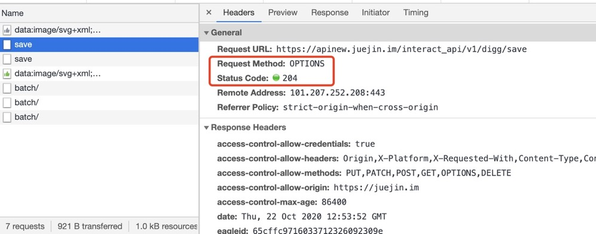

# 200/201/204/206

## 200 OK

表示请求成功，也是使用最为广泛的状态码。
如果是 GET 请求，代表资源获取成功。

```bash
$ curl --head https://www.baidu.com
HTTP/1.1 200 OK
Accept-Ranges: bytes
Cache-Control: private, no-cache, no-store, proxy-revalidate, no-transform
Connection: keep-alive
Content-Length: 277
Content-Type: text/html
Date: Tue, 16 Aug 2022 03:30:21 GMT
Etag: "575e1f72-115"
Last-Modified: Mon, 13 Jun 2016 02:50:26 GMT
Pragma: no-cache
Server: bfe/1.0.8.18
```

## 201 Created

一般用以 POST 请求，代表服务器资源创建成功。如在 Github 中，创建 Issue 成功，则返回一个 201 的状态码。以下是伪代码

```bash
# 由于 POST 创建资源需要有认证信息，因此改代码是一个伪代码
$ curl \
  -X POST \
  -H "Accept: application/vnd.github+json" \
  -H "Authorization: token <TOKEN>" \
  https://api.github.com/repos/OWNER/REPO/issues \
  -d '{"title":"Found a bug","body":"I'\''m having a problem with this.","assignees":["octocat"],"milestone":1,"labels":["bug"]}'
```


## 204 No Content

No Content，即服务器不会发送响应体（Response Body），它有以下场景：

> PS: 204 与 304 是唯二没有响应体的状态码。

1. PUT 请求，修改资源的某个状态，此时 204 代表修改成功，无需响应体。见 RFC7231 之 204 状态码
2. DELETE/OPTION 请求
3. 打点 API

示例一: 掘金为 Options 请求的状态码设置为 204



示例二: 知乎为 Delete 请求的状态码设置为 204，以下请求代表取消关注某人


由于 DELETE/OPTION 需要有认证信息，因此不进行 curl 示例。

## 206 Partial Content

当客户端指定 Range 范围请求头时，服务器端将会返回部分资源，即 Partial Content，此时状态码为 206。
当请求音视频资源体积过大时，一般使用 206 较多。

> 如果你现在去哔哩哔哩随便去看几个视频，打开浏览器控制台网络面板，会发现诸多 206 状态码。

与之相关的有以下 Header。

- range/content-range: 客户端发送 range 请求头指定范围，若满足范围，服务器返回响应头
  content-range 以及状态码 206。若不满足，则返回 416 Range Not Satisfiable 状态码。

```bash
# 请求头
Range: bytes=1-20

# 响应头
Content-Range: bytes 1-20/33229
```

示例如下：

```bash
$ curl https://q.shanyue.tech -H 'Range: bytes=1-29' --include
HTTP/2 206
server: Tengine
content-type: text/html; charset=utf-8
content-length: 29
strict-transport-security: max-age=5184000
date: Tue, 16 Aug 2022 07:22:05 GMT
vary: Accept-Encoding
x-oss-request-id: 62FB459D0925293935AC120C
x-oss-cdn-auth: success
accept-ranges: bytes
etag: "CEE08C7240A168CDB08EBD34B48CB8F7"
last-modified: Mon, 15 Aug 2022 11:08:49 GMT
x-oss-object-type: Normal
x-oss-hash-crc64ecma: 6247728796594318031
x-oss-storage-class: Standard
cache-control: no-cache
content-md5: zuCMckChaM2wjr00tIy49w==
x-oss-server-time: 34
ali-swift-global-savetime: 1660634525
via: cache22.l2cn2635[55,54,200-0,M], cache50.l2cn2635[56,0], kunlun9.cn1593[92,92,206-0,M], kunlun1.cn1593[94,0]
x-cache: MISS TCP_MISS dirn:-2:-2
x-swift-savetime: Tue, 16 Aug 2022 07:22:05 GMT
x-swift-cachetime: 0
content-range: bytes 1-29/7887
timing-allow-origin: *
eagleid: 76b4381516606345255583297e

!DOCTYPE html>
<html lang=en%

$ curl --head 'https://cn-hbyc2-dx-v-11.bilivideo.com/upgcxcode/77/99/797809977/797809977-1-30032.m4s?e=ig8euxZM2rNcNbdlhoNvNC8BqJIzNbfqXBvEqxTEto8BTrNvN0GvT90W5JZMkX_YN0MvXg8gNEV4NC8xNEV4N03eN0B5tZlqNxTEto8BTrNvNeZVuJ10Kj_g2UB02J0mN0B5tZlqNCNEto8BTrNvNC7MTX502C8f2jmMQJ6mqF2fka1mqx6gqj0eN0B599M=&uipk=5&nbs=1&deadline=1660634696&gen=playurlv2&os=vcache&oi=0&trid=0001a24d8b3329634dce8b8358b5bb862468u&mid=0&platform=pc&upsig=ff3ba7dabdea568ad472092000d89dba&uparams=e,uipk,nbs,deadline,gen,os,oi,trid,mid,platform&cdnid=9263&bvc=vod&nettype=0&orderid=0,3&agrr=1&bw=68979&logo=80000000' \
  -H 'authority: cn-hbyc2-dx-v-11.bilivideo.com' \
  -H 'if-range: c803156a' \
  -H 'origin: https://www.bilibili.com' \
  -H 'range: bytes=290774-645317' \
  -H 'referer: https://www.bilibili.com/' \
  -H 'user-agent: Mozilla/5.0 (Macintosh; Intel Mac OS X 10_15_7) AppleWebKit/537.36 (KHTML, like Gecko) Chrome/104.0.0.0 Safari/537.36'
HTTP/2 206
server: openresty
date: Tue, 16 Aug 2022 07:19:53 GMT
content-type: video/mp4
content-length: 354544
x-upsig-version: 20220222
etag: c803156a
content-range: bytes 290774-645317/5725276
last-modified: Tue, 09 Aug 2022 04:41:49 GMT
access-control-allow-headers: Origin, Referer, Range, Pragma
access-control-allow-methods: GET, HEAD, OPTIONS
access-control-allow-credentials: true
access-control-max-age: 21600
access-control-allow-origin: https://www.bilibili.com
access-control-expose-headers: X-Service-Module, Content-Length, Content-Range
x-server: cn-hbyc2-dx-v-11
x-service-module: bvc-h2-server
alt-svc: h3=":443"; ma=900, h3-29=":443"; ma=900, h3-Q050=":443"; ma=900,h3-27=":443"; ma=900,h3-T051=":443"; ma=900,h3-T050=":443"; ma=900,h3-Q046=":443"; ma=900,h3-Q043=":443"; ma=900, quic=":443"; ma=900; v="46,43"
```

## 作业

1. 201/204/206 状态码分别在什么情况下会出现？

   - 201:服务器创建资源成功
   - 204:服务器不返回响应体
     - 仅修改资源状态
     - DELETE/OPTION 请求
     - 打点 API
   - 206:当有 Range 请求头时，服务器返回部分资源

2. 浏览个人常用网站，找到 201/204/206 状态码请求

   - 201
   - 204 github
   - 206 bilibili

3. 如何对某个资源进行范围请求，在 axios/fetch/request 等库中如何请求

```js
fetch('https://baidu.com', {
  headers: { Range: ' bytes=1-10' },
})
```
