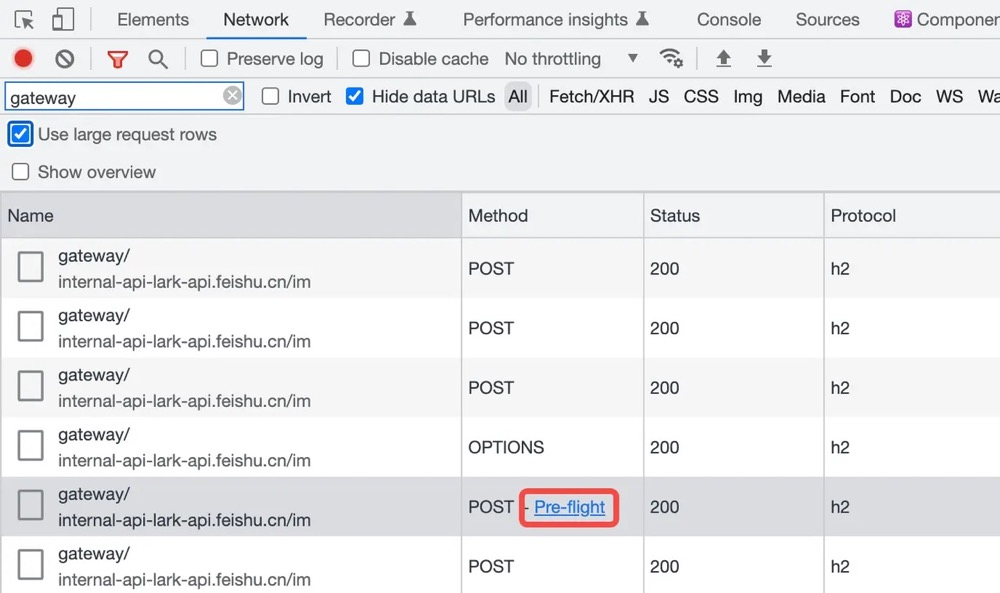

# 预检请求与简单请求

当一个请求跨域且不是简单请求时就会首先发起一个 OPTIONS 请求，被称为预检请求，也就是 preflight request。预检请求用于检查服务器是否支持 CORS。
在 Chrome 浏览器控制台中，跨域复杂请求旁，有 pre-flight 链接指向该请求的预检请求。



## 简单请求

以下条件构成了简单请求：

1. Method: 请求的方法是 GET、POST 及 HEAD。也被称为 CORS-safelisted method
2. Header: 请求头是 Content-Type (有限制，见下)、Accept-Language、Content-Language 等。也被称为 CORS-safelisted request-header
3. Content-Type: 请求类型是 application/x-www-form-urlencoded、multipart/form-data 或 text/plain

非简单请求一般需要开发者主动构造，在项目中常见的 Content-Type: application/json 及 Authorization: `<token>` 为典型的非简单请求。

## 预检请求

在一个跨域的非简单请求之前，将会发送预检请求 OPTIONS 请求，将会携带以下三个请求头，用以向服务器咨询是否支持该跨域请求。该过程类似于 Accept 的内容协商。

```bash
# 是否支持 POST 方法
Access-Control-Request-Method: POST
# 是否支持携带 content-type 请求头
Access-Control-Request-Headers: content-type
# 来自域名 https://shanyue.tech 的跨域请求
Origin: https://shanyue.tech
```

同时回复响应头，用以确认是否支持 CORS。

```bash
# 允许跨域的头部
Access-Control-Allow-Headers: Content-Type,Content-Length,Accept-Encoding,X-CSRF-Token,accept,origin,Cache-Control,X-Requested-With,X-USE-PPE,X-TT-ENV
# 允许跨域的方法
Access-Control-Allow-Methods: POST, OPTIONS, GET
# 允许跨域的域名
Access-Control-Allow-Origin: *
# OPTIONS 预检请求的缓存时间，即在 600s 内不会再次发送 OPTIONS 请求
Access-Control-Max-Age: 600
# 是否允许携带权限信息，比如 cookie 一类，下一章细讲
Access-Control-Allow-Credentials: true
```

预检请求用于检测服务器是否支持 CORS，以便确认最终是否发送正常请求，由于它通过响应头进行判断，无需 Body，因此关于 OPTIONS 请求的状态码可选择 204 No Content。
如果预检请求失败，不允许跨域，则该复杂请求则会在浏览器控制台看到 CORS Error，并将该请求标记为红色。


## 作业

1. 什么是简单请求

   - Method:GET、POST、HEAD
   - Header:Content-Type 部分类型、Accept-Language、Content-Language
   - Content-Type:application/x-www-form-urlencoded、multipart/form-data、 text/plain

2. 什么情况下会发送 OPTIONS 预检请求

   在一个跨域的非简单请求之前

3. 如何避免过多 OPTIONS 请求造成的性能损耗

   服务端配置响应头增加 OPTIONS 预检请求的缓存时间如：
   Access-Control-Max-Age: 600
   会在 600s 内不在发出 OPTIONS 请求
