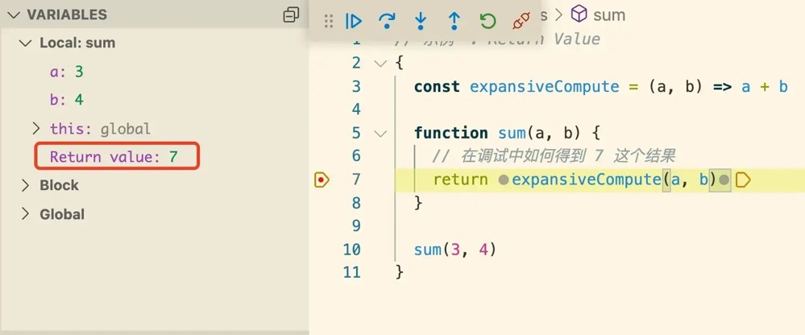
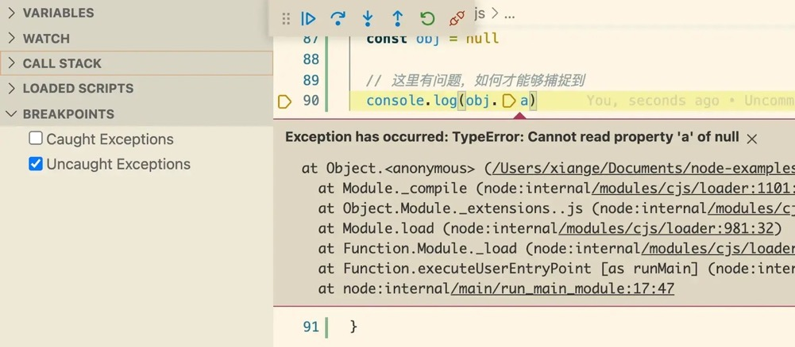

# 调试基础与示例

使用 Javascript 写代码，无论是在 Node 后端环境还是前端单页应用，调试是资深程序员的进身之阶！
程序员的水平提升之路只有一条，那就是乐此不疲地调试代码。

## 如何进行调试

- Resume: 执行到下一个断点
- Step Over: 执行下一语句
- Step Into: 执行下一语句，如遇到函数，则进入函数执行
- Step Out: 跳出当前函数
  要素也就以上四点，如同五子棋的五子连珠，规则简单却演化甚多。
  以下诸多个问题，或者说调试技巧，与调试环境无关，无论你是在浏览器还是在 VS Code 中调试，都可以有效提高你的调试技巧。
  以下所有代码，可见我的 Github: shfshanyue/node-examples

## Return Value

### 如何通过调试获取函数的返回值

当函数返回的是一个表达式时，如何在 debug 中，在当前函数中获取到返回值
如下例所示，如何在 sum 函数中通过调试得到 7，而非获取到 a 和 b 再两者相加

```js
const expansiveCompute = (a, b) => a + b

function sum(a, b) {
  // 在调试中如何得到 7 这个结果
  return expansiveCompute(a, b)
}

sum(3, 4)
```



解: 将断点打到 return 语句，执行到该行，并再次 Step Over，将在调试功能的变量面板中得到 Return value。

## Step Over

### 当单行调用多个函数表达式时，Step Over 是跳过一行还是一个表达式？

```js
// 当此行有断点时，Step Over 进入哪里
const l = [1, 2, 3, 4, 5].map((x) => sum(x, 1)).filter((x) => x > 3)

const n = sum(sum(3, 4), 1)
```

解: 当使用 Step Over 时，跳过整行。在平常代码需要调试时，可使用 Step Into 逐表达式调试，或者分为两行，可见下一个示例。

### 多层嵌套与行内断点

当我们在某行打断点调试时，本质上是对该行的第一个断点位置进行断点。是了，一行代码其实有多个位置可打断点，请看下图红点处。


### 当单行调用多个函数表达式时，如何进入特定函数中进行 debug

(不通过对指定函数起始位置打断点的方法，因为有时无法得知指定函数位置)

```js
// 如何进入到 `.filter` 函数中进行调试
const l = [1, 2, 3, 4, 5].map((x) => sum(x, 1)).filter((x) => x > 3)

// 如何进入到 sub 函数中进行调试
const n = sub(sum(2, sum(3, 4)), 1)
```

解: 此时可使用行内断点，在正确的位置进行打断点。不过，方便调试，还是多上表达式比较方便。


### 在单行调用多个函数表达式时，如何设置条件断点

```js
// 如何在 map 函数中，当 x === 3 时打断点
const l = [1, 2, 3, 4, 5].map((x) => sum(x, 1))
```

解: 右键编辑断点即可。


## Promise/Async

在 Node 与浏览器环境中，关于 promise 的调试有所不同，由于 async_hooks 的存在，node 中的调试经常会陷入无关的系统源码，而在浏览器环境中就简单很多。

### 如何进入到 promise.then 函数中进行调试？

Promise.resolve(3).then(o => {
// 如何 StepOver/StepInto 到当前行进行调试
console.log(o)
})

console.log('hello, world')

解: 直接打断点吧。

### 如何跳进 await 的函数中进行调试？

const sleep = (seconds) => {
// 从 await sleep(2000) 如何调试到这里边
console.log('DEBUG TO HERE')
return new Promise(resolve => setTimeout(resolve, seconds))
}

await sleep(2000)

### 以下 sum 函数和 asyncSum 函数 Step Into 的步骤是否一致？

function sum (a, b) {
return a + b
}

async function asyncSum (a, b) {
return a + b
}

async function main () {
const r1 = await sum(3, 4)
const r2 = await asyncSum(3, 4)
}

解: 在浏览器中并无二致，但在 Node 中将会进入 async_hooks 内部代码，此时可多次 step out 跳出。

## Error

### 当发生异常时，如何直接断点到异常位置调试

这估计是解决 Bug 时最有效的调试手段了。


解: 在左侧 BreakPoints 面板中，直接勾选 Uncaught Exceptions 即可。

## 总结

今天讲了许多关于 Javascript 调试的基础与示例，以后关于调试的文章将会涉及到以下两点

1. 在调试源码(React/Vue)时有哪些技巧？
2. 如何在 Node/VSCode 中调试？
3. 如何更好地调试 Node/C++ 跨语言代码？
