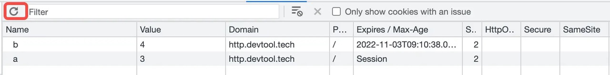

# Cookie 的操作

Cookie 一般由服务器端 Set-Cookie 响应头进行设置，其实，在浏览器本身也可以通过 Javascript 进行 Cookie 的增删改查。
在浏览器中，可通过 document.cookie API 进行 Cookie 的操作。

```js
> document.cookie
'_ga=GA1.2.1876001903.1605866723; __tea_cookie_tokens_2608=%257B%2522user_unique_id%2522%253A%25226897145057464911373%2522%252C%2522web_id%2522%253A%25226897145057464911373%2522%252C%2522timestamp%2522%253A1641894930459%257D; MONITOR_DEVICE_ID=dd404a56-9058-42cf-9ffc-97d60d0a6a1f; MONITOR_WEB_ID=48c1030d-d089-4f90-8773-42fda9aa206d; _tea_utm_cache_2608={%22utm_source%22:%22web5%22%2C%22utm_medium%22:%22feed%22%2C%22utm_campaign%22:%22database202211%22}; tt_scid=94tFH.DyNrkXmY-izqbHmWybz7rcZiN-QpJ45KuO0EGNFYv.X9J7UvwOrhUhDtD18dd6'
```

## 操作

```js
// 赋值 Cookie a 为 3
> document.cookie = 'a=3'
'a=3'

// 赋值 Cookie b 为 4，并配置 100s 的过期时间
> document.cookie = 'b=4; max-age=100'
'b=4'
```

通过浏览器控制台进行以上操作，并在控制台 Application 面板的 Cookies 选项卡查看 Cookie，当有 Cookie 变动时，可点击左上角的刷新按钮。



而删除某个 Cookie，将该 Cookie 的过期时间修改为过去即可。

```js
// 删除 Cookie a
document.cookie = 'a=3; max-age=-1;'
```

而要获取某个 cookie，则需要解析字符串进行获取了。见源码 js-cookie

```js
function get(name) {
  if (typeof document === 'undefined' || (arguments.length && !name)) {
    return
  }

  // To prevent the for loop in the first place assign an empty array
  // in case there are no cookies at all.
  var cookies = document.cookie ? document.cookie.split('; ') : []
  var jar = {}
  for (var i = 0; i < cookies.length; i++) {
    var parts = cookies[i].split('=')
    var value = parts.slice(1).join('=')

    try {
      var found = decodeURIComponent(parts[0])
      jar[found] = converter.read(value, found)

      if (name === found) {
        break
      }
    } catch (e) {}
  }

  return name ? jar[name] : jar
}
```

## CookieStore

在原始对 Cookie 进行增删改查的操作中，一切都是以对 document.cookie 解析作为基础。js-cookie 对其进行了封装，大部分项目中都是使用它对 Cookie 进行操作。

> PS：你去你们项目中的 lockfile 中，说不定也可以找到 js-cookie 这个第三方包。

而在最近的 DOM API 规范中，新出了 CookieStore API 用于操作 Cookie。


```js
> await cookieStore.getAll()
[
    {
        "domain": null,
        "expires": null,
        "name": "a",
        "path": "/",
        "sameSite": "lax",
        "secure": false,
        "value": "3"
    },
    {
        "domain": null,
        "expires": null,
        "name": "b",
        "path": "/",
        "sameSite": "lax",
        "secure": false,
        "value": "4"
    },
    {
        "domain": null,
        "expires": null,
        "name": "c",
        "path": "/",
        "sameSite": "lax",
        "secure": false,
        "value": "5"
    }
]

> await cookieStore.get('a')
```

## 作业

1. 如何通过 Javascript 添加 Cookie

   `document.cookie = 'b=4; max-age=100'`

2. 如何通过 Javascript 删除 Cookie

   将 cookie 过期时间修改为过去
   `document.cookie = 'a=3; max-age=-1;'`

3. 如何通过 CookieStore API 增删改查 Cookie

```js
// 增
document.cookie = 'a=1'
// 删
cookieStore.delete('a')
// 改
cookieStore.set('a', '2')
// 查
cookieStore.get('a')
cookieStore.getAll()
```
