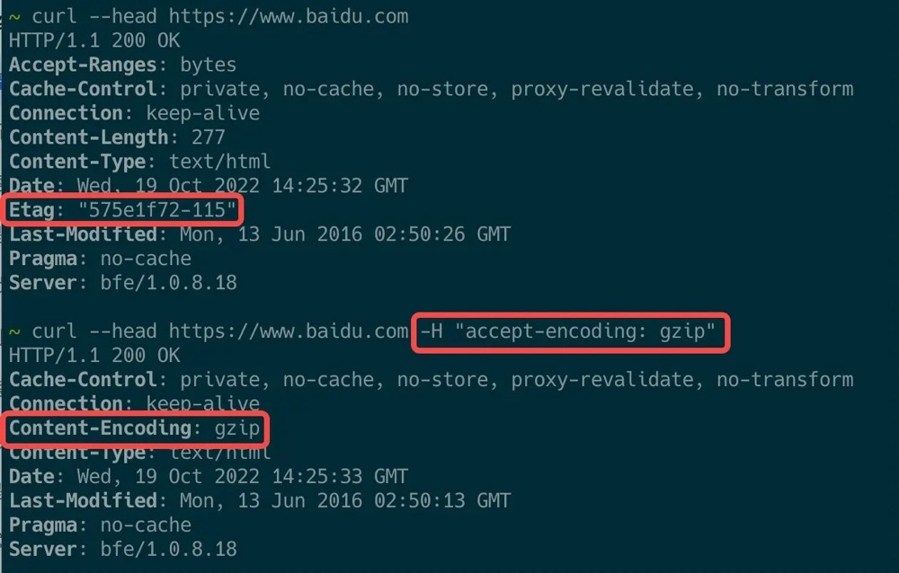
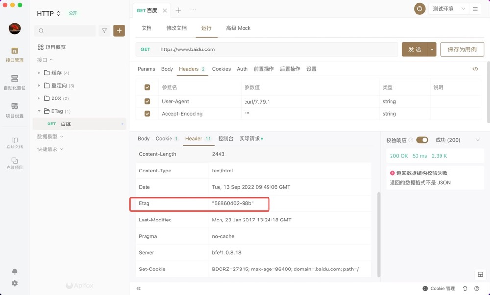

# 协商缓存响应头生成算法

## Last-Modified

针对静态资源而言，一般会选择文件的 mtime 元属性作为上次修改时间，该元属性表示文件内容的修改时间。
关于 mtime 可参考 文件元属性及 stat 命令。

```c
nginx 也是这样处理的，源码见: ngx_http_static_module.c
    r->headers_out.status = NGX_HTTP_OK;
    r->headers_out.content_length_n = of.size;
    r->headers_out.last_modified_time = of.mtime;
```

但是，Last-Modified 拥有一定的局限性

1. 时间精读只有秒级别，但某文件在一秒内被更改 N 次
2. 某一文件经过修改后，但是文件内容并未发生变化，比如添加一行再删除该行

## ETag

ETag 拥有比 Last-Modified 更高的精读，从 HTTP 规范上来讲，可以解决以上问题。
比如针对文件内容进行 hash 计算，得到 hash 值作为 ETag 的值。
但是从实现上而言，往往不使用会消耗大量 CPU 的 hash 计算，比如 nginx，源码见：ngx_http_core_modules.c

```c
etag->value.len = ngx_sprintf(etag->value.data, "\"%xT-%xO\"",
                                  r->headers_out.last_modified_time,
                                  r->headers_out.content_length_n)
                      - etag->value.data;
```

nginx 中 ETag 由响应头的 Last-Modified 与 Content-Length 表示为十六进制组合而成。

```bash
$ docker exec -it $(docker run -d nginx:alpine) curl --head localhost
HTTP/1.1 200 OK
Server: nginx/1.23.0
Date: Tue, 13 Sep 2022 09:24:39 GMT
Content-Type: text/html
Content-Length: 615
Last-Modified: Tue, 21 Jun 2022 17:06:59 GMT
Connection: keep-alive
ETag: "62b1fab3-267"
Accept-Ranges: bytes
```

正因如此，即便 http 响应头中 ETag 值改变了，也不意味着文件内容一定已更改

## 实例

百度首页使用了 Nginx 类似的 ETag 生成算法

```bash
$ curl --head https://www.baidu.com
HTTP/1.1 200 OK
Accept-Ranges: bytes
Cache-Control: private, no-cache, no-store, proxy-revalidate, no-transform
Connection: keep-alive
Content-Length: 277
Content-Type: text/html
Date: Sun, 16 Oct 2022 10:59:26 GMT
Etag: "575e1f72-115"
Last-Modified: Mon, 13 Jun 2016 02:50:26 GMT
Pragma: no-cache
Server: bfe/1.0.8.18
```

> 注意：在浏览器控制台网络面板查看百度首页的请求，将会发现没有 ETag 响应头字段，**是因为压缩也会压缩响应头**，此与内容协商相关。
> 在浏览器中，会自动发送 accept-encoding: gzip, deflate, br，因此在浏览器中返回后数据往往都是经过 gzip/brotli 压缩。见 9. 内容协商
> 

以下截图是我在 Apifox 的演示：


## 作业

1. ETag 值是如何生成的

   实现方法不同，nginx 是由响应头的 Last-Modified 与 Content-Length 表示为十六进制组合而成

2. ETag 与 Last-Modified 有何区别
   Last-Modified 时间精度只有秒级别且对修改后恢复的文件无反应，ETag 拥有比 Last-Modified 更高的精度，且可以自定义实现方式，根据 Last-Modified 与其他请求头综合取值

3. 如果 http 响应头中 ETag 值改变了，是否意味着文件内容一定已经更改

   并不一定，看具体实现方式，例如 nginx， 会在文件长度没变且 Last-Modified 更改时改变
