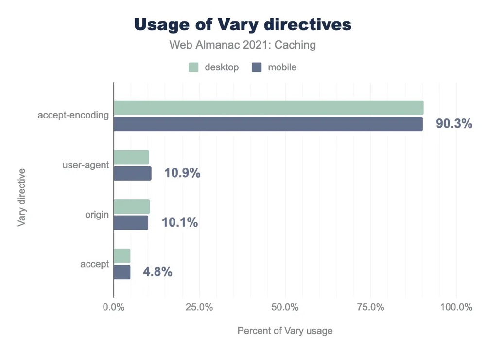

# 多域名跨域

CORS 通过控制 Access-Control-Allow-Origin 控制哪些域名可以共享资源，取值如下

```bash
Access-Control-Allow-Origin: <origin> | *
```

其中 \* 代表所有域名，origin 代表指定特定域名，那如何设置多个域名了？
首先，用 \* 不可以，因为 \* 不可以携带 cookie，见下图。


此时需要通过代码实现，**根据 Origin 请求头来设置响应头 Access-Control-Allow-Origin**。

## 请求头: Origin

并不是所有请求都会自动带上 Origin，在浏览器中带 Origin 的逻辑如下：

1. 如果存在跨域，则带上 Origin，值为当前域名
2. 如果不存在跨域，则不带 Origin

逻辑理清楚后，关于服务器中对于 Access-Control-Allow-Origin 设置多域名的逻辑也很清晰了

1. 如果请求头不带有 Origin，证明未跨域，则不作任何处理
2. 如果请求头带有 Origin，证明跨域，根据 Origin 设置相应的 `Access-Control-Allow-Origin: <Origin>`

使用伪代码实现如下:

```js
// 获取 Origin 请求头
const requestOrigin = req.getHeader('Origin')

// 如果没有，则跳过
if (!requestOrigin) {
  return
}

// 如果有，则动态设置响应头
res.setHeader('Access-Control-Allow-Origin', requestOrigin)
```

## Vary: Origin

此时可以给多个域名控制 CORS，但此时假设有两个域名访问 static.shanyue.tech 的跨域资源

1. foo.shanyue.tech，响应头中返回 Access-Control-Allow-Origin: foo.shanyue.tech
2. bar.shanyue.tech，响应头中返回 Access-Control-Allow-Origin: bar.shanyue.tech

看起来一切正常，但如果中间有缓存怎么办？

1. foo.shanyue.tech，响应头中返回 Access-Control-Allow-Origin: foo.shanyue.tech，被 CDN 缓存
2. bar.shanyue.tech，因由缓存，响应头中返回 Access-Control-Allow-Origin: foo.shanyue.tech，跨域出现问题

此时，Vary: Origin 就上场了，代表为不同的 Origin 缓存不同的资源。

## Vary

```bash
Vary: <header-name>, <header-name>, ...
```

可理解为用以缓存的 key 值，常用于内容协商，因为内容协商往往会根据 Accept/Accept-Language 返回不同的资源。
比如对于国际化而言，中文版资源与英文版资源应单独缓存，否则 CDN 缓存了中文版资源，对所有用户都分发英文版资源，将会出现大问题。
2021 HTTP 网络年鉴 中指出，Vary 所指定的请求头中，Accept-Encoding 占 90%，而 Origin 占 10%，应该是用于 CORS 配置。


## 总结

CORS 如何指定多个域名？
根据请求头中的 Origin 来设置响应头 Access-Control-Allow-Origin，思路如下

1. 总是设置 Vary: Origin，避免 CDN 缓存破坏 CORS 配置
2. 如果请求头不带有 Origin，证明未跨域，则不作任何处理
3. 如果请求头带有 Origin，证明浏览器访问跨域，根据 Origin 设置相应的 `Access-Control-Allow-Origin: <Origin>`

使用伪代码实现如下

```js
// 获取 Origin 请求头
const requestOrigin = req.getHeader('Origin')

res.setHeader('Vary', 'Origin')

// 如果没有，则跳过
if (!requestOrigin) {
  return
}

// 设置响应头
res.setHeader('Access-Control-Allow-Origin', requestOrigin)
```

## 作业

1. 如何配置多个域名允许跨域

   通过代码控制，根据 Origin 请求头来设置响应头
   Access-Control-Allow-Origin 为请求头 Origin，如果没有则跳过

2. 如何避免 CDN 为 PC 端缓存移动端页面

   通过配置 Vary:user-agent 响应头

3. 如何避免 CDN 为中文版缓存英文版页面

   通过配置 Vary:accept-language 响应头
