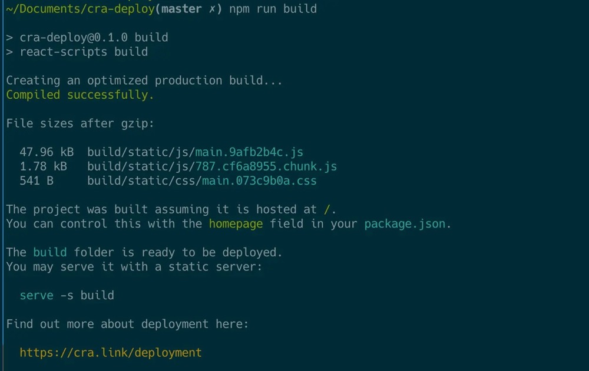

# 使用 node api 学习 webpack​

在我们使用 webpack 的大部分项目中，都需要使用 webpack.config.js 来配置 webpack。​
我们学习 webpack 的过程也就是学习 webpack 配置文件的过程，因此人称 webpack 配置工程师。​
但在学习过程中，我个人不建议使用 webpack.config.js 配置文件的方式来学习 webpack。​
其中一个原因就是：webpack cli 实在是太难调试了！​

## 跳来跳去的 webpack cli​

当我们在终端执行 webpack 命令时发生了什么？​

`$ webpack`

1. 调用执行 webpack 包对应的 bin/webpack.js 文件，然后继续调用 webpack-cli 包 ​
2. 调用执行 webpack-cli 包对应的 bin/cli.js 文件，然后继续调用 webpack 包 ​
3. 调用执行 webpack 包的 API 进行打包 ​

你说，这直接调用 webpack 的 API 进行学习岂不更好吗？​
​

​
除了学习， webpack api 还有一些其他场景。​

## 基于 webpack api 开发脚手架 ​

如果你需要基于 webpack 做一个脚手架，那大概率是通过 webpack api 来完成。​
比如 create-react-app 的 react-scripts，便是直接通过 webpack api 进行打包。​
[见代码](https://github.com/facebook/create-react-app/blob/main/packages/react-scripts/scripts/build.js#L146)。​
我们可以通过编译结束后的 stat 对象拿到打包后所有资源体积，以及打包时间。当基于 webpack api 开发脚手架后，其脚手架的构建日志也可以进行自定义。​
​
​​

其它脚手架应该也是，但我没有一一验证。

## ​webpack api 简介

使用 webpack api 也特别容易，将以前 webpack.config.js 的配置，作为参数传递给 webpack 函数即可。详见文档 webpack node api。

> Q：既然直接将参数传递给 webpack 函数即可，那 webpack-cli 的主要作用岂不是读取文件？既然是读取文件，那为何跳来跳去，甚至会多出一个 webpack-cli 的包呢？
> 示例如下：

```javascript
const webpack = require('webpack')

const compiler = webpack({
  // webpack 的诸多配置置于此处
  entry: './index.js',
})

compiler.run((err, stat) => {
  // 在 stat 中可获取关于构建的时间及资源等信息
})
```

使用 webpack 进行学习及测试也非常方便，比如使用它测试不同 mode 对打包资源的影响：

```javascript
webpack([
  {
    entry: './index.js',
    mode: 'production',
    output: {
      filename: 'main.production.js',
    },
  },
  {
    entry: './index.js',
    mode: 'development',
    output: {
      filename: 'main.development.js',
    },
  },
  {
    entry: './index.js',
    output: {
      filename: 'main.unknown.js',
    },
  },
]).run((err, stat) => {})
```

## 关于 webpack 的示例

我将所有关于 webpack 学习的示例放在了 node-examples 中。
执行 node build.js，用以查看构建示例，而在 build.js 中，会维护 N 份 webpack 配置。

```javascript
// 学习配置一
function f1() {
  return webpack({
    entry: './index.js',
    mode: 'none',
    output: {
      iife: false,
      pathinfo: 'verbose',
    },
  })
}

// 学习配置二
function f2() {
  return webpack({
    entry: './index.js',
    mode: 'none',
    optimization: {
      runtimeChunk: true,
    },
  })
}

// 学习配置一时，切换到 f1，学习配置二时，切换到 f2
f1().run((err, stat) => {
  console.log(stat.toJson())
})
```

## 了解 Stat/Compilation

在 webpack 编译结束后，可拿到 Stat 对象，其中包含诸多编译时期的信息。
比如，可通过该对象获取到打包后所有资源体积以及编译时间。


可通过以下命令及文档查阅以下对象。

```bash
# jq 需要手动安装，是一个 JSON 处理器

$ node build.js | jq -C "." | less
```

可在其中获取到以下数据结果，可在调试中自行观察期数据结构，将在后续文章中讲到。

- Asset
- Chunk
- Module
- Entry

## 作业

1. 使用 webpack api 打包一个最简的 js 资源

   

2. 你所使用含有 webpack 的项目中，webpack 是通过 webpack-cli 打包的吗？

   是，nextjs 和 umijs 2.直播后明白并不是，nextjs 和 umijsj 将 webpack 包直接放入 compiled 文件夹 ，防止依赖更新带来的问题，所以是 api 打包的

3. 如何计算每次 webpack 构建时间

   stat.toJson().time
   stat.endTime - stat.statTime

4. 断点调试 webpack 源码，了解其编译时间（startTime/endTime）是如何计算的

   首先进入 run 函数
   
   可以看到直接定义了 startTime
   下面是要找 endTime
   先看最后的调用逻辑
   

   如果是判断是否闲置，两种情况都执行内部的 run 函数
   

   再看 run 函数，如果错误执行的 finalCallback 把 err 传给用户，没有错误则执行 onCompiled 函数
   

   这里便赋值了 startTime 和 endTime，compilation 对象是在调用 onCompiled 时由 webpack 实例的 compile 编译函数传过来的参数
   然后 new Stats 生成 stats 实例，实例根据 Stats 里定义的
   

   get 函数即可访问 startTime 和 endTime

5. 断点调试执行 webpack 命令时的流程，体验它是如何在 webpack/webpack-cli 间相互调用的

   首先执行 webpack/bin/webpack.js
   

   其中 runCli 函数根据传入的 cli 对象拼接路径，加载 webpack-cli/bin/cli.js
   pkg.bin[cli.binName]即 pkg.bin['webpack-cli']
   webpack-cli 的 package.json 里配置了 bin
   

   调用逻辑是判断是否安装 webpack，未安装时引导安装，已安装则直接调用 webpack-cli
   
